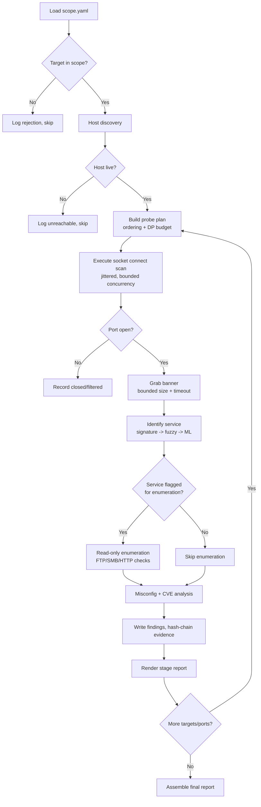
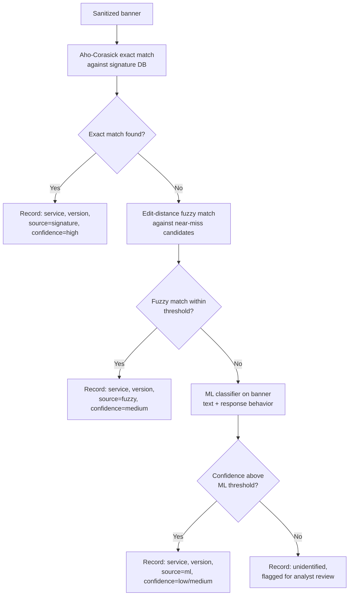

# Step 3: Algorithm Development — Pseudocode and Flowchart

> Part of the `secure-audit-port-scanner` SDLC documentation.
> Source course reference: *Step 3: Algorithm Development — Pseudocode or
> Flowchart*.
> Builds on [`01-problem-definition.md`](./01-problem-definition.md) and
> [`02-problem-analysis.md`](./02-problem-analysis.md).

Each module below gets pseudocode. The overall pipeline and the two
algorithmically interesting sub-flows (probe planning, banner
identification) get flowcharts. Module boundaries match
`src/` in the repo structure from the README, so this doc should translate
directly into function signatures when implementation starts.

---

## 0. Overall pipeline flowchart



---

## 1. Scope and Authorization Gate

**Pseudocode**

```
FUNCTION load_scope(path):
    config = parse_yaml(path)
    VALIDATE config has: authorized_targets, excluded_targets,
                          engagement_window, authorizer
    IF now() NOT WITHIN engagement_window:
        RAISE ScopeError("outside authorized engagement window")
    RETURN ScopeSet(authorized_targets, excluded_targets)

FUNCTION is_in_scope(target, scope_set):
    IF target IN scope_set.excluded_targets:
        RETURN False
    FOR entry IN scope_set.authorized_targets:
        IF target == entry OR target IN cidr_range(entry):
            RETURN True
    RETURN False

FUNCTION filter_targets(requested_targets, scope_set, audit_log):
    approved = []
    FOR target IN requested_targets:
        IF is_in_scope(target, scope_set):
            approved.append(target)
        ELSE:
            audit_log.record("REJECTED_OUT_OF_SCOPE", target)
    RETURN approved
```

**Complexity:** O(T·E) where T = requested targets, E = scope entries
(CIDR membership check per entry). Negligible relative to scan time; this
gate is a one-time check per target, not per port.

---

## 2. Host Discovery

**Pseudocode**

```
FUNCTION discover_live_hosts(targets, timeout):
    live = []
    FOR target IN targets (concurrently, bounded):
        TRY:
            response = tcp_probe_or_icmp(target, timeout)
            IF response.received:
                live.append(target)
                audit_log.record("HOST_LIVE", target)
        CATCH Timeout:
            audit_log.record("HOST_UNREACHABLE", target)
    RETURN live
```

---

## 3. Probe Plan: Ordering + DP Budget

This is the module where "searching" (ordering) and "dynamic programming"
(budgeting) combine, as identified in Step 2.

### 3a. Port ordering (static priority + adaptive timeout)

```
FUNCTION order_ports(port_range, priority_list):
    ordered = priority_list items that are in port_range
    remaining = shuffled(port_range - priority_list)   # avoid sequential pattern
    RETURN ordered + remaining

FUNCTION calibrate_timeout(host, low_bound, high_bound, sample_ports):
    # binary search between a fast and slow RTT bound
    low, high = low_bound, high_bound
    WHILE high - low > precision:
        mid = (low + high) / 2
        success = probe_sample(host, sample_ports, timeout=mid)
        IF success_rate(success) >= acceptable_threshold:
            high = mid        # mid works, try faster
        ELSE:
            low = mid         # mid too fast, back off
    RETURN high
```

### 3b. 0/1 knapsack DP for probe scheduling

Each probe unit = one (host, port-tier) group. `cost` = estimated time to
scan that group; `value` = expected information yield (higher for priority
tiers / hosts flagged as higher-risk, e.g. "legacy server" from the
engagement brief).

```
FUNCTION schedule_probes(units, budget):
    # units: list of (id, cost, value)
    # budget: total time/connection allowance
    n = length(units)
    dp = 2D array[0..n][0..budget] initialized to 0

    FOR i FROM 1 TO n:
        FOR w FROM 0 TO budget:
            IF units[i].cost <= w:
                dp[i][w] = max(
                    dp[i-1][w],
                    dp[i-1][w - units[i].cost] + units[i].value
                )
            ELSE:
                dp[i][w] = dp[i-1][w]

    # Backtrack to find selected units
    selected = []
    w = budget
    FOR i FROM n DOWNTO 1:
        IF dp[i][w] != dp[i-1][w]:
            selected.append(units[i])
            w = w - units[i].cost

    RETURN selected, dp[n][budget]   # chosen plan + total value, for the report
```

**Complexity:** O(N·W) time and space, N = probe units (host×tier groups,
not individual ports), W = budget granularity. Confirmed small relative to
scan time in Step 2's efficiency table. The DP table (or just the chosen
allocation) is written to the stage-1 report so the budget decision is
explainable to an auditor.

---

## 4. Port Scanning (`socket` connect scan)

**Pseudocode**

```
FUNCTION scan_port(host, port, timeout, jitter_range):
    sleep(random_uniform(jitter_range))     # avoid constant-rate signature
    sock = socket(AF_INET, SOCK_STREAM)
    sock.settimeout(timeout)
    TRY:
        sock.connect((host, port))
        RETURN PortState.OPEN, sock
    CATCH ConnectionRefused:
        RETURN PortState.CLOSED, None
    CATCH Timeout:
        RETURN PortState.FILTERED, None
    FINALLY:
        IF state != OPEN:
            sock.close()

FUNCTION run_scan(host, ordered_ports, semaphore, timeout, jitter_range):
    results = []
    FOR port IN ordered_ports (concurrently, bounded by semaphore):
        state, sock = scan_port(host, port, timeout, jitter_range)
        results.append((port, state, timestamp_now()))
        audit_log.record("PORT_PROBE", host, port, state)
        IF state == OPEN:
            queue_for_banner_grab(host, port, sock)
    write_immutable(results, "01_recon/parsed/ports.json")
    RETURN results
```

---

## 5. Banner Grabbing

Banners are untrusted, attacker-controlled input (threat model flag carried
over from Step 1) — read is bounded in both size and time.

```
FUNCTION grab_banner(sock, max_bytes, read_timeout):
    sock.settimeout(read_timeout)
    TRY:
        raw = sock.recv(max_bytes)       # hard cap, never unbounded read
    CATCH Timeout:
        raw = b""                         # no banner volunteered; not an error
    sock.close()
    sanitized = strip_control_chars(decode_best_effort(raw))
    store_raw_immutable(raw_base64_encode(raw))   # evidence, byte-faithful
    RETURN sanitized
```

---

## 6. Service Identification: Signature → Fuzzy → ML

### Flowchart



### Pseudocode

```
FUNCTION build_signature_automaton(signature_db):
    automaton = AhoCorasick()
    FOR signature IN signature_db:
        automaton.add_pattern(signature.text, signature.service_info)
    automaton.build()
    RETURN automaton                      # built once per run, reused per banner

FUNCTION identify_service(banner, automaton, signature_db, ml_model):
    matches = automaton.search(banner)    # O(len(banner) + matches)
    IF matches NOT EMPTY:
        best = highest_specificity(matches)
        RETURN ServiceMatch(best.service, best.version,
                             source="signature", confidence="high")

    candidates = near_miss_candidates(banner, signature_db, max_pool=K)
    best_fuzzy = None
    FOR candidate IN candidates:           # pool bounded -> cost bounded
        distance = edit_distance(banner, candidate.text)  # DP, O(n*m)
        IF distance <= candidate.fuzzy_threshold:
            IF best_fuzzy IS None OR distance < best_fuzzy.distance:
                best_fuzzy = (candidate, distance)
    IF best_fuzzy IS NOT None:
        RETURN ServiceMatch(best_fuzzy.candidate.service,
                             best_fuzzy.candidate.version,
                             source="fuzzy", confidence="medium")

    IF ml_model IS available:
        prediction, score = ml_model.classify(banner)
        IF score >= ML_CONFIDENCE_THRESHOLD:
            RETURN ServiceMatch(prediction.service, prediction.version,
                                 source="ml", confidence=score_band(score))

    RETURN ServiceMatch(None, None, source="none",
                         confidence="unidentified", review_flag=True)

FUNCTION edit_distance(a, b):
    # classic DP, rolling-array to bound memory
    prev_row = [0, 1, 2, ..., length(b)]
    FOR i FROM 1 TO length(a):
        curr_row[0] = i
        FOR j FROM 1 TO length(b):
            cost = 0 IF a[i] == b[j] ELSE 1
            curr_row[j] = min(
                prev_row[j] + 1,          # deletion
                curr_row[j-1] + 1,        # insertion
                prev_row[j-1] + cost      # substitution
            )
        prev_row = curr_row
    RETURN prev_row[length(b)]
```

**Guard (from the threat model):** `banner` is truncated to `max_bytes` at
ingestion (Module 5), which bounds both `len(banner)` here and the fuzzy
candidate pool size `K` — a malicious long banner cannot blow up the DP
cost.

---

## 7. Enumeration (read-only)

```
FUNCTION enumerate_service(host, port, service_match):
    IF service_match.service NOT IN ENUMERABLE_SERVICES:
        RETURN None
    checks = ENUMERATION_RULES[service_match.service]   # e.g. ftp-anon, smb-enum-shares
    results = []
    FOR check IN checks:
        output = run_readonly_tool(check, host, port, timeout)
        audit_log.record("ENUMERATION", host, port, check.name)
        results.append(output)
    store_raw_immutable(results, "03_enumeration/raw/")
    RETURN results
```

No write operations are ever issued against a discovered share or service —
every `check` in `ENUMERATION_RULES` is read-only by construction.

---

## 8. Misconfiguration and CVE-Candidate Analysis

```
FUNCTION analyze_findings(services, enumeration_results, cve_snapshot):
    findings = []
    FOR entry IN services:
        FOR rule IN MISCONFIG_RULES:
            IF rule.applies_to(entry, enumeration_results):
                findings.append(Finding(
                    type=rule.name,
                    status="confirmed",       # observed directly
                    evidence_ref=rule.evidence_pointer
                ))
        IF entry.version IS NOT None:
            candidates = cve_snapshot.lookup(entry.service, entry.version)
            FOR cve IN candidates:
                findings.append(Finding(
                    type="cve_candidate",
                    cve_id=cve.id,
                    status="inferred",        # version-based only, not exploited/verified
                    evidence_ref=entry.source
                ))
    write_immutable(findings, "04_analysis/findings.json")
    RETURN findings
```

Every finding's `status` field (`confirmed` vs `inferred`) is what lets the
final report separate "we observed this" from "this version is known to
have this CVE" — the false-positive distinction from the source slides.

---

## 9. Evidence Integrity (Hash Chaining)

```
FUNCTION append_audit_entry(event, prev_hash):
    entry = {
        timestamp: now(),
        run_id: current_run_id,
        event: event,
        prev: prev_hash
    }
    entry.hash = sha256(serialize(entry))
    append_to_log(entry, "audit.log")
    RETURN entry.hash

FUNCTION generate_manifest(evidence_dir):
    manifest = {}
    FOR file IN walk(evidence_dir):
        manifest[file.path] = sha256(file.contents)
    write(manifest, "MANIFEST.sha256")
    IF signing_enabled:
        sign(manifest, private_key)
```

---

## 10. Report Generation

```
FUNCTION render_stage_report(stage_name, stage_data, template):
    markdown = Jinja2.render(template[stage_name], stage_data)
    write(markdown, f"{stage_dir}/report_{stage_name}.md")
    RETURN markdown

FUNCTION assemble_final_report(all_stage_reports, findings, run_metadata):
    doc = new_docx()
    FOR section IN REPORT_SECTIONS:
        # Reconnaissance Summary, Nmap/Scan Results, Service Enumeration
        # and Risk Indicators, Attack Surface Analysis,
        # Network Scan Strategy Reflection, Lessons Learned
        content = gather_section_content(section, all_stage_reports, findings)
        IF section.requires_analyst_judgment:
            content = mark_as("ANALYST REVIEW REQUIRED", content)
        doc.add_section(section.title, content)
    save(doc, "05_final/report.docx")
    export_pdf(doc, "05_final/report.pdf")
```

---

## Notes for implementation

- Every `FUNCTION` above should become a pure, testable unit where possible
  — the DP scheduler, edit distance, and signature matching are all good
  unit-test targets with no network dependency.
- The flowcharts match the module directories in the README's repo
  structure 1:1, so each box/diamond above should be traceable to a
  specific file under `src/`.
- Step 4 (threat model) will refine the guards noted inline here (banner
  size caps, fuzzy-match pool bounds, read-only enumeration) into a full
  STRIDE analysis before any of this is implemented.
