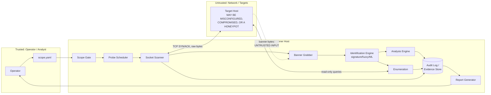

# Step 4: Threat Model (STRIDE)

> Part of the `secure-audit-port-scanner` SDLC documentation.
> Builds on [`01-problem-definition.md`](./01-problem-definition.md),
> [`02-problem-analysis.md`](./02-problem-analysis.md), and
> [`03-algorithm-design.md`](./03-algorithm-design.md).
>
> This is the Design-phase deliverable of the secure SDLC. No implementation
> should start on a module until its threats below have a mitigation that
> maps to a specific pseudocode guard in Step 3.

## 1. Scope of this threat model

**In scope:** the scanner itself as an attack surface — what happens if a
malicious or malfunctioning *target* feeds it hostile data, what happens if
the tool is misused by its own operator, and how the evidence chain can be
attacked.

**Out of scope:** vulnerabilities *discovered by* the scanner in MetroCare's
infrastructure (that's the tool's output, covered in `findings.json` and the
report, not a threat to the tool). Physical security of the lab. Supply-chain
compromise of the OS/Python runtime itself (covered briefly under SCA in the
README, not re-derived here).

## 2. System overview and trust boundaries

**Trust boundaries (where this diagram matters):**

1. **Operator ↔ Scanner** — the operator is trusted but can still make
   mistakes (wrong scope file, wrong profile). The scope gate protects
   against operator error as much as malice.
2. **Scanner ↔ Target** — the hard boundary. Everything crossing this line
   *from* the target (banner bytes, enumeration responses, connection
   timing) is untrusted input, full stop, even though the target is "just"
   a server the operator is authorized to scan.
3. **Scanner ↔ Evidence Store** — internal, but still a boundary: once data
   crosses from "live scan state" into "evidence," it must become
   immutable. A bug or compromise downstream of this line should not be
   able to rewrite what was recorded.

## 3. Assets to protect

| Asset                                                                | Why it matters                                                                                                                                                                     |
| -------------------------------------------------------------------- | ---------------------------------------------------------------------------------------------------------------------------------------------------------------------------------- |
| Evidence integrity (`audit.log`, `MANIFEST.sha256`, raw banners) | The entire point of the engagement is defensible, audit-ready evidence. If it can be silently altered, the engagement's output is worthless to a regulator.                        |
| Scan/evidence confidentiality                                        | Banners, open-port lists, and findings describe exploitable weaknesses in a hospital network — this data is itself sensitive and potentially PHI-adjacent.                        |
| Target availability                                                  | Legacy and possibly clinical-adjacent systems (per the MetroCare scenario) can fail under load; an availability incident caused by the scanner is a serious harm, not a minor bug. |
| Scope boundary                                                       | Scanning outside authorization is both a legal/ethical violation and the single most damaging failure mode for the tool.                                                           |
| Classifier/signature DB integrity                                    | A poisoned signature DB or ML model produces false findings (or hides true ones), corrupting every downstream report.                                                              |
| Operator attribution                                                 | Evidence must show*who* ran *what*, *when* — losing this breaks the audit trail even if the technical results are correct.                                                  |

## 4. Actors

| Actor                                            | Trust level                                   | Relevant capability                                                                                                        |
| ------------------------------------------------ | --------------------------------------------- | -------------------------------------------------------------------------------------------------------------------------- |
| Authorized operator                              | Trusted, but fallible                         | Configures and runs scans; could misconfigure scope or budget                                                              |
| Target host (in scope)                           | **Untrusted**, even though authorized   | Sends banner bytes, enumeration responses, timing behavior — all attacker-controllable if the host is already compromised |
| Network observer (e.g., hospital NIDS/blue team) | Neutral, not adversarial to this threat model | Sees scan traffic; relevant to footprint design, not a threat to the tool itself                                           |
| Malicious/compromised in-scope host              | Adversarial                                   | Could be a honeypot or tarpit designed to exploit the scanner, not just get scanned by it                                  |
| Insider with evidence-store access               | Adversarial (low likelihood, high impact)     | Could attempt to alter evidence after the fact                                                                             |

## 5. STRIDE analysis by component

### 5.1 Scope Gate

| Threat                           | Description                                                                                                                                   | Mitigation                                                                                                                     | Maps to (Step 3)                   |
| -------------------------------- | --------------------------------------------------------------------------------------------------------------------------------------------- | ------------------------------------------------------------------------------------------------------------------------------ | ---------------------------------- |
| **S**poofing               | Operator supplies a target list that isn't actually theirs to claim authorization over (e.g., typo'd CIDR overlapping an out-of-scope subnet) | Scope file requires explicit authorizer name + engagement window; CIDR entries validated and logged at load time, not inferred | §1`load_scope`, `is_in_scope` |
| **T**ampering              | `scope.yaml` is modified mid-run to widen scope                                                                                             | Scope is loaded once at run start and hashed into the audit log; mid-run scope changes require a new run                       | §1, §9                           |
| **R**epudiation            | Operator later denies having scanned an out-of-scope host                                                                                     | Every target evaluation (pass or reject) is logged with operator identity and timestamp before any socket opens                | §1`filter_targets`              |
| **I**nformation disclosure | `scope.yaml` itself (network layout, authorizer name) leaks                                                                                 | Treated as sensitive config; not committed to the repo (confirmed`.gitignore`'d per README)                                  | n/a — repo hygiene                |
| **D**enial of service      | N/A at this component                                                                                                                         | —                                                                                                                             | —                                 |
| **E**levation of privilege | N/A at this component                                                                                                                         | —                                                                                                                             | —                                 |

### 5.2 Socket Scanner

| Threat                                                                   | Description                                                                                                                               | Mitigation                                                                                                                                       | Maps to                            |
| ------------------------------------------------------------------------ | ----------------------------------------------------------------------------------------------------------------------------------------- | ------------------------------------------------------------------------------------------------------------------------------------------------ | ---------------------------------- |
| **D**enial of service (caused *by* the tool, against the target) | Scanner overwhelms a fragile legacy host with concurrent connections                                                                      | Hard ceiling on concurrency/rate that config cannot override past a max; jitter spreads load                                                     | §4`run_scan`, semaphore-bounded |
| **D**enial of service (against the tool)                           | Target or network holds connections open / slow-drips to exhaust scanner resources (slowloris-style against the*scanner's* socket pool) | Connect and read timeouts are mandatory, not optional; bounded concurrency caps total open sockets                                               | §4, §5                           |
| **T**ampering                                                      | On-path attacker injects spoofed RST/SYN-ACK to produce false port-state readings                                                         | Out of scope to fully defend against on an untrusted network path (would need SYN cookies/raw packet validation); noted as a residual risk below | —                                 |
| **R**epudiation                                                    | Scan results don't match what was actually sent                                                                                           | Every probe attempt and result is logged individually (§4), not just aggregated                                                                 | §4, §9                           |

### 5.3 Banner Grabber — the primary untrusted-input boundary

| Threat                                                     | Description                                                                                                                                                                                 | Mitigation                                                                                                                                                                                                                    | Maps to                                      |
| ---------------------------------------------------------- | ------------------------------------------------------------------------------------------------------------------------------------------------------------------------------------------- | ----------------------------------------------------------------------------------------------------------------------------------------------------------------------------------------------------------------------------- | -------------------------------------------- |
| **D**enial of service                                | Target sends an unbounded stream of bytes to exhaust scanner memory                                                                                                                         | `recv()` capped at `max_bytes` hard limit, never an unbounded read                                                                                                                                                        | §5`grab_banner`                           |
| **D**enial of service                                | Target never closes the connection, holding the read open                                                                                                                                   | Mandatory`read_timeout`, enforced per-connection                                                                                                                                                                            | §5                                          |
| **T**ampering (of downstream systems via the banner) | Banner contains log-injection payloads (newlines, ANSI escape codes, terminal control sequences) designed to forge fake log entries or corrupt terminal output when an analyst reviews logs | `strip_control_chars` + "decode best effort" before any banner is written to a human-readable log or report; raw bytes stored separately as base64 for fidelity, never interpreted                                          | §5, §9                                     |
| **I**nformation disclosure                           | Banner is logged/reported without sanitization, and contains something that breaks report rendering (e.g., Markdown/HTML injection into the generated report)                               | Sanitize before template rendering (§10); raw evidence stays base64-encoded and is never directly interpolated into the DOCX/PDF                                                                                             | §5, §10                                    |
| **E**levation of privilege                           | Banner is crafted to exploit a parser vulnerability (buffer handling, encoding confusion) in the scanner itself                                                                             | Memory-safe language choice (Python) per the README; no custom binary parsing of banner bytes;`decode_best_effort` uses a safe, exception-handled decode (e.g., `errors="replace"`), never a raw C-level buffer operation | §5, and general language choice from Step 1 |

**This is the single highest-priority component in the threat model.** Every
byte here originates from a host the operator does not control, even though
it's "authorized to scan" — authorization is not the same as trust.

### 5.4 Identification Engine (signature / fuzzy / ML)

| Threat                            | Description                                                                                                                                                                                                           | Mitigation                                                                                                                                                                                                                                    | Maps to                                                           |
| --------------------------------- | --------------------------------------------------------------------------------------------------------------------------------------------------------------------------------------------------------------------- | --------------------------------------------------------------------------------------------------------------------------------------------------------------------------------------------------------------------------------------------- | ----------------------------------------------------------------- |
| **D**enial of service       | Fuzzy matching (edit-distance DP) is O(n·m); a maliciously long or crafted banner could be designed to maximize comparison cost across many candidates                                                               | Banner length already capped at ingestion (§5); fuzzy candidate pool bounded to`K` entries (§6); rolling-array edit distance to bound memory, not just time                                                                               | §6`identify_service`, guard noted inline                       |
| **T**ampering               | Signature DB is modified (accidentally or maliciously) to misclassify a known-vulnerable service as benign                                                                                                            | Signature DB is versioned and date-stamped (per README); its hash is recorded in the run manifest so any drift is detectable after the fact                                                                                                   | §6, §9                                                          |
| **T**ampering (ML-specific) | Adversarial banner is crafted to evade the ML classifier or to make a benign service look vulnerable (or vice versa) — "adversarial or poisoned banners" flagged back in the original Secure SDLC verification notes | ML output is always labeled with its source and confidence band, never presented as equal-weight to a signature match; anomaly detection flags responses whose timing/behavior looks engineered (honeypot/tarpit pattern) rather than organic | §6 flowchart (confidence bands), README verification-phase notes |
| **R**epudiation             | A finding's origin (signature vs. fuzzy vs. ML) isn't traceable later                                                                                                                                                 | Every`ServiceMatch` carries `source` and `confidence` fields that flow through to `findings.json` and the report                                                                                                                      | §6, §8                                                          |
| **I**nformation disclosure  | ML model artifact itself leaks training data characteristics (less relevant here — small lab-derived dataset)                                                                                                        | Low risk given dataset size and scope (phase 2); revisit if the dataset grows to include real client data                                                                                                                                     | —                                                                |

### 5.5 Enumeration

| Threat                           | Description                                                                                                              | Mitigation                                                                                                                                    | Maps to                  |
| -------------------------------- | ------------------------------------------------------------------------------------------------------------------------ | --------------------------------------------------------------------------------------------------------------------------------------------- | ------------------------ |
| **E**levation of privilege | Enumeration is scoped to be read-only, but a bug could let an enumeration "check" accidentally send a write/auth-attempt | `ENUMERATION_RULES` are read-only *by construction* — each check is an explicit allowlisted read operation, not a generic command runner | §7`enumerate_service` |
| **D**enial of service      | Enumeration tools (e.g.,`enum4linux`) run unbounded against a slow/unresponsive service                                | Timeout enforced on every`run_readonly_tool` call, consistent with scanner-level timeout policy                                             | §7                      |
| **T**ampering              | Enumeration output (e.g., SMB share listing) contains the same log-injection risk as banners                             | Same sanitize-before-log treatment as banners; raw tool output stored immutably, sanitized copy used for report rendering                     | §7, §9, §10           |

### 5.6 Analysis Engine (misconfig + CVE)

| Threat                | Description                                                                                    | Mitigation                                                                                                                                                                    | Maps to                                                                            |
| --------------------- | ---------------------------------------------------------------------------------------------- | ----------------------------------------------------------------------------------------------------------------------------------------------------------------------------- | ---------------------------------------------------------------------------------- |
| **T**ampering   | Stale or tampered CVE snapshot produces wrong findings                                         | CVE snapshot is dated and versioned; its date is recorded in every report so findings are explicitly time-bound ("CVE data as of 2026-09-01"), not presented as live-verified | §8, README                                                                        |
| **R**epudiation | A finding doesn't distinguish "we observed this" from "this version is known to have this CVE" | Every finding carries `status: confirmed                                                                                                                                      | inferred` — this was a design decision from Step 2/3 specifically to prevent this |

### 5.7 Evidence Store / Audit Log

| Threat                           | Description                                                                                                  | Mitigation                                                                                                                                                                                 | Maps to                                          |
| -------------------------------- | ------------------------------------------------------------------------------------------------------------ | ------------------------------------------------------------------------------------------------------------------------------------------------------------------------------------------ | ------------------------------------------------ |
| **T**ampering              | Evidence is altered after the fact (by a bug, or by someone with disk access) to hide or fabricate a finding | Hash-chained audit log (each entry references`prev` hash); per-stage `MANIFEST.sha256`; raw evidence files are written once and set read-only                                          | §9`append_audit_entry`, `generate_manifest` |
| **R**epudiation            | No way to prove the manifest itself wasn't regenerated after tampering                                       | Optional signing of the manifest with a private key (noted in README); final manifest digest should be stored off-box/externally for the same reason noted in the original evidence design | §9                                              |
| **I**nformation disclosure | Evidence directory contains sensitive findings/PHI-adjacent data readable by anyone with host access         | Evidence directory gets restrictive filesystem permissions; optional encryption at rest (carried over from the PHI-minimization constraint in Step 1)                                      | Step 1 constraints, §9                          |
| **D**enial of service      | Disk fills up from excessive raw evidence (e.g., repeated large banners)                                     | Per-banner size cap (§5) bounds worst case per entry; overall evidence directory size should be monitored (operational control, not purely algorithmic)                                   | §5, operational                                 |

**Residual risk — insider/host compromise:** hash chaining and manifests are
*tamper-evident*, not *tamper-proof*. If the scanner host itself is fully
compromised, an attacker with root could rewrite the whole chain
consistently. The mitigation is operational, not algorithmic: store the
final manifest digest somewhere off that host (e.g., emailed to the
engagement lead, committed to a separate access-controlled system) so a
rewritten on-host chain can still be detected by comparison.

### 5.8 Report Generator

| Threat                | Description                                                                                                                               | Mitigation                                                                                                                                  | Maps to                       |
| --------------------- | ----------------------------------------------------------------------------------------------------------------------------------------- | ------------------------------------------------------------------------------------------------------------------------------------------- | ----------------------------- |
| **T**ampering   | Banner/enumeration content injects Markdown/HTML/DOCX-breaking sequences into the rendered report                                         | Template rendering uses sanitized text only (§5, §7); raw bytes never flow directly into Jinja2/python-docx calls                         | §10                          |
| **R**epudiation | Report presents an ML-sourced or inferred finding with the same visual weight as a confirmed, signature-based one, misleading the auditor | Confidence/status fields (§6, §8) are rendered explicitly in the report, and judgment-based sections are marked "ANALYST REVIEW REQUIRED" | §10`assemble_final_report` |

## 6. Cross-cutting abuse cases

These were flagged qualitatively back in the Secure SDLC requirements notes
(Step 1); restating them here with concrete mitigations now that the design
exists to point to.

| Abuse case                                                                                                       | Mitigation                                                                                                                                                                    |
| ---------------------------------------------------------------------------------------------------------------- | ----------------------------------------------------------------------------------------------------------------------------------------------------------------------------- |
| Operator points the tool at a target not in`scope.yaml`, accidentally or deliberately                          | Scope gate rejects before any socket opens (§5.1); rejection is logged, not silently dropped                                                                                 |
| Operator cranks concurrency/rate far above safe levels to "scan faster," risking a hospital system outage        | Hard ceiling in config that cannot be overridden past a sane max (Step 1 constraint, enforced in §4)                                                                         |
| Tool is pointed at a honeypot/tarpit designed to waste scanner time or feed poisoned data into the ML classifier | Anomaly detection on response timing/behavior (§5.4, deferred to phase 2); until then, per-host time budgets (§3b DP scheduler) cap worst-case time lost to any single host |
| Evidence is altered post-scan to hide a finding before the audit                                                 | Hash chain + manifest + off-box digest storage (§5.7)                                                                                                                        |
| A malicious banner is crafted specifically to attack the scanner's own parser or DP matcher                      | Bounded reads, bounded candidate pools, memory-safe language, sanitization before any interpretation (§5.3, §5.4)                                                           |

## 7. Severity and priority summary

Rough prioritization for the Verification phase (Step 5/6), ranked by
impact × likelihood given this is an internal lab/portfolio engagement
context:

| Priority         | Threat                                                                       | Why                                                                                                  |
| ---------------- | ---------------------------------------------------------------------------- | ---------------------------------------------------------------------------------------------------- |
| **High**   | Banner-driven DoS/parser issues (§5.3)                                      | Banners are the clearest untrusted-input boundary; must be solid before any real scanning happens    |
| **High**   | Target availability impact from scan rate (§5.2, §6)                       | Direct harm to the engagement's own subject (hospital-like environment)                              |
| **Medium** | Evidence tampering (§5.7)                                                   | Core to the tool's value proposition (audit-ready evidence), but requires host compromise to exploit |
| **Medium** | Log/report injection via banners or enumeration output (§5.3, §5.5, §5.8) | Real but contained impact — corrupts a report, doesn't compromise the host                          |
| **Low**    | Fuzzy-match / signature-matching cost DoS (§5.4)                            | Already structurally bounded by the §5 banner cap; residual risk is small                           |
| **Low**    | ML adversarial evasion (§5.4)                                               | Phase 2 feature, not yet implemented; address when the classifier is built, not before               |

## 8. What this changes in Step 3's design

Every guard that Step 3's pseudocode already noted inline (banner size cap,
fuzzy-match pool bound, read-only enumeration, sanitize-before-log) is now
justified by a specific threat above rather than "general good practice."
Two items from this analysis are **new requirements for implementation**
that weren't explicit before:

1. **Off-box manifest digest storage** — needs a concrete mechanism (email,
   second system, etc.) decided before the first real run, not left
   implicit.
2. **Signature DB and CVE snapshot hashing into the run manifest** — Step 3's
   `generate_manifest` should explicitly include these as inputs, not just
   output evidence files.

## 9. Review cadence

This threat model should be revisited whenever: a new module is added (e.g.,
the `stealth` SYN scan profile), the ML classifier moves from phase 2 design
to implementation, or after any incident during lab testing. Treat it as a
living document under `docs/sdlc/`, versioned alongside the code it
constrains.
